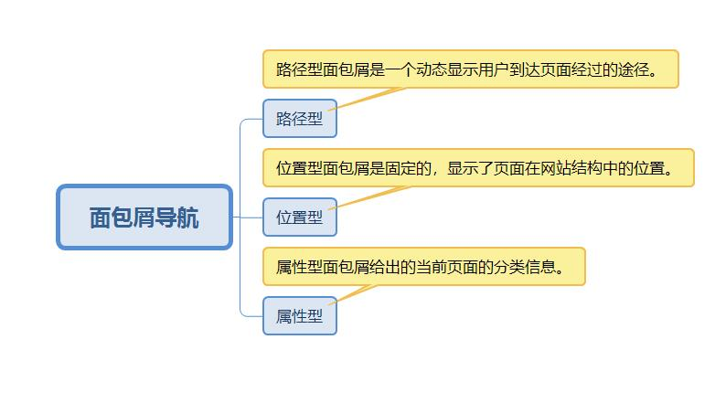

# 什么是面包屑导航

> 面包屑导航（英语：Breadcrumb Trail）是在用户界面中的一种导航辅助。它是用户一个在程序或文件中确定和转移他们位置的一种方法。面包屑这个词来自糖果屋这个童话故事。

有如下分类：



# 如何实现

项目的用到如下的面包屑，从主页面的左侧工具栏点击站点地图，右侧会展示系统所有的菜单，菜单分三级，其中菜单1是菜单2的父级菜单，菜单2是菜单3的父级菜单。

首页/站点地图/菜单1/菜单2/菜单3

实现的一个思路，当点击菜单3时，要展示上面的位置导航信息，可以根据该菜单ID在数据库中查出菜单2，然后再查出菜单3，然后将该数据返回到前台来，前台展示。

# 实现一个面包屑导航样式

html结构使用ul和a标签实现。

```html
<!DOCTYPE html>
<html>

<head>
    <title>面包屑导航</title>
    <!-- <link rel="stylesheet" type="text/css" href="css/bootstrap-3.0.0/css/bootstrap.css"> -->
    <style type="text/css">
    .crumb ul li {
        float: left;
        list-style-type: none;
    }

    .crumb ul li a {
        display: block;
        margin: 0 10px 0 0;
        height: 30px;
        background-color: #3498db;
        color: #fff;
        text-decoration: none;
        padding: 10px 50px 0 50px;
        position: relative;
    }

    .crumb ul li a:after {
        content: "";
        border-top: 20px solid transparent;
        border-bottom: 20px solid transparent;
        border-left: 20px solid #3498db;
        position: absolute;
        right: -20px;
        top: 0;
        z-index: 5;
    }

    .crumb ul li a:before {
        content: "";
        border-top: 20px solid #3498db;

        border-left: 20px solid white;
        border-bottom: 20px solid #3498db;
        position: absolute;
        left: 0px;
        top: 0;
    }

    .crumb ul li:first-child a {
        border-top-left-radius: 20px;
        border-bottom-left-radius: 20px;
    }

    .crumb ul li:first-child a:before {
        display: none;
    }

    .crumb ul li:last-child a {
        padding-right: 60px;
        border-top-right-radius: 20px;
        border-bottom-right-radius: 20px;
    }

    .crumb ul li:last-child a:after {
        display: none;
    }

    .crumb ul li a:hover {
        background: #fa5ba5;
    }

    .crumb ul li a:hover:after {
        border-left-color: #fa5ba5;
    }

    .crumb ul li a:hover:before {
        border-top-color: #fa5ba5;
        border-bottom-color: #fa5ba5;
    }
    </style>
</head>

<body>
    <div class="crumb">
        <ul>
            <li><a href="#">导航栏1</a></li>
            <li><a href="#">导航栏2</a></li>
            <li><a href="#">导航栏3</a></li>
            <li><a href="#">导航栏4</a></li>
        </ul>
    </div>
    <div>
</body>

</html>
```


